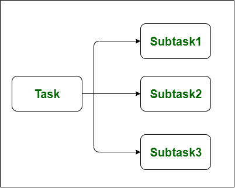

<div align="center">
  <h1 style="text-align: center;font-weight: bold">Praktikum 10<br>Praktek Sistem Operasi</h1>
  <h4 style="text-align: center;">Dosen Pengampu : Dr. Ferry Astika Saputra, S.T., M.Sc.</h4>
</div>
<br />
<div align="center">
  
  <h3 style="text-align: center;">Disusun Oleh : </h3>
  <p style="text-align: center;">
    <strong>Calvin Raditya Sandy Winarto - 3123500009</strong><br>
    <strong>Zada Devi Mariama - 3123500015</strong>
  </p>
<h3 style="text-align: center;line-height: 1.5">Politeknik Elektronika Negeri Surabaya<br>Departemen Teknik Informatika Dan Komputer<br>Program Studi Teknik Informatika<br>2023/2024</h3>
  <hr>
</div>
<br>
<br>
<br>


# Threads

<!--  -->

## Multithread Server Architecture
### Benefits
- Responsiveness
    - Memungkinkan suatu program untuk terus berjalan meskipun sebagian dari program tersebut diblokir atau menjalankan operasi yang panjang
    - Dalam lingkungan non multi-thread, server mendengarkan port untuk beberapa permintaan dan ketika permintaan itu datang, server memproses permintaan tersebut dan kemudian melanjutkan mendengarkan permintaan lain.
    - Jika proses dibagi menjadi beberapa thread, jika satu thread menyelesaikan eksekusinya, maka outputnya dapat segera dikembalikan.

- Resource Sharing
    - Message Passing
    - Shared Memory
    ```
    Teknik-teknik diatas diatur secara eksplisit oleh programmer. Namun, thread berbagi memori dan sumber daya dari proses yang menjadi miliknya secara default. Manfaat berbagi kode dan data adalah memungkinkan aplikasi memiliki beberapa rangkaian aktivitas dalam ruang alamat yang sama.
    ```

- Economy
    - Mengalokasikan memori dan sumber daya untuk pembuatan proses adalah pekerjaan yang mahal dalam hal waktu dan ruang.
    - Proses pembuatan 30 kali lebih lambat dibandingkan pembuatan thread dan peralihan konteks 5 kali lebih lambat.

- Scalability 
    - Thread dapat berjalan paralel pada beberapa prosesor.
    - Proses thread tunggal hanya dapat berjalan pada satu prosesor, berapa pun jumlah prosesor yang tersedia.
    - Multi-threading pada mesin multi-CPU meningkatkan paralelisme.

- Better Communication System
    - Menyediakan bandwidth yang sangat tinggi dan komunikasi yang rendah di berbagai tugas dalam aplikasi.

- Microprocessor Architecture Utilization
    - Thread dapat dijalankan secara paralel pada prosesor berbeda yang dapat diperkuat secara signifikan dalam arsitektur mikroprosesor
    - Multithreading meningkatkan konkurensi pada mesin multi CPU.
    - CPU juga berpindah antar thread dengan sangat cepat dalam arsitektur prosesor tunggal yang menciptakan ilusi paralelisme,

- Minimized system resource usage
    - Biaya tambahan untuk membuat, memelihara, dan mengelola thread lebih rendah dibandingkan proses umum.

- Enhanced Concurrency
    - Multithreading dapat meningkatkan konkurensi mesin multi-CPU. Hal ini karena multithreading memungkinkan setiap thread dieksekusi secara paralel pada prosesor yang berbeda.

- Reduced Context Switching Time
    - Thread meminimalkan waktu peralihan konteks seperti pada Peralihan Konteks Thread, ruang memori virtual tetap sama.

## Multicore Programming
```
Sistem Multicore terdiri dari dua atau lebih prosesor yang telah terpasang pada satu chip untuk meningkatkan kinerja, mengurangi konsumsi daya, dan pemrosesan beberapa tugas secara simultan lebih efisien.
```

- Dividing Activities
    - Memeriksa tugas dengan benar untuk menemukan area yang dapat dibagi menjadi subtugas terpisah dan bersamaan yang dapat dijalankan secara paralel pada masing-masing prosesor untuk memanfaatkan banyak inti komputasi secara lengkap.
   
- Balance 
    - Kesetaraan harus dipastikan sedemikian rupa sehingga setiap subtugas dapat melakukan jumlah pekerjaan yang hampir sama.
    - Tidak boleh ada satu sub tugas memiliki banyak pekerjaan yang harus dilakukan dan sub tugas lainnya memiliki sangat sedikit pekerjaan yang harus dilakukan karena dalam hal ini pemrograman sistem multicore mungkin tidak meningkatkan kinerja dibandingkan dengan sistem single core.

- Data splitting
    - Data yang diakses dan dimanipulasi oleh tugas tersebut harus dibagi agar dapat dijalankan pada inti yang berbeda sehingga data dapat dengan mudah diakses oleh setiap subtugas.

- Data dependency
    - Karena berbagai subtugas yang lebih kecil dijalankan pada inti yang berbeda, ada kemungkinan bahwa satu subtugas bergantung pada data dari subtugas lainnya. Jadi datanya perlu diperiksa dengan baik agar pelaksanaan seluruh tugas bisa sinkron. 

- Testing and Debugging
    - Ketika berbagai sub-tugas yang lebih kecil dijalankan secara paralel, maka pengujian dan debugging tugas-tugas bersamaan tersebut lebih sulit daripada pengujian dan debugging aplikasi thread tunggal. 

## Difference between Concurrency and Parallelism
- Concurrency
    - Pendekatan yang digunakan untuk mengurangi waktu respons sistem dengan menggunakan unit pemrosesan tunggal. Konkurensi menciptakan ilusi paralelisme, namun sebenarnya potongan tugas tidak diproses secara paralel, namun di dalam aplikasi, ada lebih dari satu tugas yang diproses dalam satu waktu. Itu tidak sepenuhnya mengakhiri satu tugas sebelum memulai tugas berikutnya. Konkurensi dicapai melalui operasi interleaving proses pada unit pemrosesan pusat (CPU) atau dengan kata lain dengan peralihan konteks. itulah alasannya seperti pemrosesan paralel. Ini meningkatkan jumlah pekerjaan yang diselesaikan pada suatu waktu.
    

- Parallelism
    - Penerapan di mana tugas dibagi menjadi sub-tugas yang lebih kecil yang diproses secara bersamaan atau paralel. Ini digunakan untuk meningkatkan throughput dan kecepatan komputasi sistem dengan menggunakan banyak prosesor. Hal ini memungkinkan CPU sekuensial tunggal untuk melakukan banyak hal “tampaknya” secara bersamaan. 
    

## Perbedaan antara Konkurensi dan Paralelisme

| No | Konkurensi                                                                 | Paralelisme                                                           |
|----|---------------------------------------------------------------------------|----------------------------------------------------------------------|
| 1  | Konkurensi adalah tugas menjalankan dan mengelola beberapa komputasi secara bersamaan. | Paralelisme adalah tugas menjalankan banyak komputasi secara bersamaan. |
| 2  | Konkurensi dicapai melalui operasi interleaving proses pada unit pemrosesan pusat (CPU) atau dengan kata lain dengan peralihan konteks. | Paralelisme dicapai melalui beberapa unit pemrosesan pusat (CPU).    |
| 3  | Konkurensi dapat dilakukan dengan menggunakan satu unit pemrosesan.       | Paralelisme tidak dapat dilakukan dengan menggunakan satu unit pemrosesan, dibutuhkan beberapa unit pemrosesan. |
| 4  | Konkurensi meningkatkan jumlah pekerjaan yang diselesaikan pada suatu waktu. | Paralelisme meningkatkan throughput dan kecepatan komputasi sistem.  |
| 5  | Konkurensi menangani banyak hal secara bersamaan.                         | Paralelisme melakukan banyak hal secara bersamaan.                   |
| 6  | Konkurensi adalah pendekatan aliran kontrol non-deterministik.            | Paralelisme adalah pendekatan aliran kendali deterministik.          |
| 7  | Dalam proses debug, konkurensi sangat sulit.                              | Dalam proses debug, paralelisme juga sulit tetapi lebih sederhana dibandingkan konkurensi. |

## Amdahl Law
```
Rumus yang digunakan untuk mencari perbaikan semaksimal mungkin hanya dengan memperbaiki bagian tertentu dari suatu sistem. Ini sering digunakan dalam komputasi paralel untuk memprediksi kecepatan teoretis saat menggunakan banyak prosesor. Speedup- Speedup didefinisikan sebagai rasio kinerja untuk keseluruhan tugas menggunakan peningkatan dan kinerja untuk seluruh tugas tanpa menggunakan peningkatan atau speedup dapat didefinisikan sebagai rasio waktu eksekusi untuk seluruh tugas tanpa menggunakan peningkatan dan waktu eksekusi untuk seluruh tugas menggunakan peningkatan
```

## User Threads dan Kernel Threads

| No. | Parameter                       | Thread Tingkat Pengguna                                    | Thread Tingkat Kernel                                              |
|--------|---------------------------------|------------------------------------------------------------|--------------------------------------------------------------------|
| 1      | Diterapkan oleh                 | Thread pengguna diterapkan oleh pengguna.                  | Thread kernel diterapkan oleh Sistem Operasi (OS).                 |
| 2      | Mengenali                       | Sistem operasi tidak mengenali thread tingkat pengguna.    | Thread kernel diakui oleh Sistem Operasi.                          |
| 3      | Implementasi                    | Implementasi thread pengguna mudah.                         | Implementasi thread tingkat kernel rumit.                          |
| 4      | Waktu pergantian konteks        | Waktu pergantian konteks lebih sedikit.                     | Waktu pergantian konteks lebih banyak.                             |
| 5      | Dukungan perangkat keras        | Pergantian konteks tidak memerlukan dukungan perangkat keras. | Dukungan perangkat keras diperlukan.                               |
| 6      | Operasi blokir                  | Jika satu thread tingkat pengguna melakukan operasi blokir maka seluruh proses akan diblokir. | Jika satu thread kernel melakukan operasi blokir maka thread lain bisa melanjutkan eksekusi. |
| 7      | Multithreading                  | Aplikasi multithread tidak bisa memanfaatkan multiprocessing. | Kernel bisa multithread.                                           |
| 8      | Pembuatan dan Manajemen         | Thread tingkat pengguna bisa dibuat dan dikelola lebih cepat. | Thread tingkat kernel membutuhkan lebih banyak waktu untuk membuat dan mengelola. |
| 9      | Sistem Operasi                  | Setiap sistem operasi dapat mendukung thread tingkat pengguna. | Thread tingkat kernel spesifik sistem operasi.                     |
| 10     | Manajemen Thread                | Library thread berisi kode untuk pembuatan thread, pengiriman pesan, penjadwalan thread, transfer data, dan penghancuran thread. | Kode aplikasi tidak mengandung kode manajemen thread. Ini hanyalah API ke mode kernel. Sistem operasi Windows memanfaatkan fitur ini. |
| 11     | Contoh                          | Contoh: Thread Java, thread POSIX.                         | Contoh: Window Solaris.                                            |
| 12     | Keuntungan                      | - Sederhana dan cepat untuk membuat. <br> - Dapat berjalan di setiap sistem operasi. <br> - Berkinerja lebih baik daripada thread kernel karena mereka tidak perlu melakukan panggilan sistem untuk membuat thread. <br> - Pergantian antara thread tidak memerlukan hak istimewa mode kernel. | - Penjadwalan banyak thread yang termasuk dalam proses yang sama pada prosesor yang berbeda adalah mungkin. <br> - Multithreading bisa ada di rutin kernel. <br> - Ketika thread di tingkat kernel dihentikan, kernel dapat menjadwalkan thread lain untuk proses yang sama. |
| 13     | Kerugian                        | - Aplikasi multithread pada thread tingkat pengguna tidak dapat mendapatkan manfaat dari multiprocessing. <br> - Jika satu thread tingkat pengguna melakukan operasi blokir, seluruh proses dihentikan. <br> - Mengalihkan kontrol dalam proses dari satu thread ke thread lain membutuhkan mode beralih ke mode kernel. <br> - Thread tingkat kernel membutuhkan lebih banyak waktu untuk membuat dan mengelola daripada thread tingkat pengguna. | - Jika satu thread jatuh, tidak selalu mempengaruhi yang lain.    |
| 14     | Manajemen memori                | Dalam thread tingkat pengguna, setiap thread memiliki stack sendiri, tetapi mereka berbagi ruang alamat yang sama. | Thread tingkat kernel memiliki stack mereka sendiri dan ruang alamat mereka sendiri, jadi mereka lebih terisolasi satu sama lain. |
| 15     | Toleransi kesalahan             | Thread tingkat pengguna kurang toleran terhadap kesalahan daripada thread tingkat kernel. Jika thread tingkat pengguna jatuh, itu bisa menjatuhkan seluruh proses. | Thread tingkat kernel dapat dikelola secara independen, jadi jika satu thread jatuh, itu tidak selalu mempengaruhi yang lain. |
| 16     | Pemanfaatan sumber daya         | Thread tingkat pengguna tidak memanfaatkan sepenuhnya sumber daya sistem, karena mereka tidak memiliki akses langsung ke fitur tingkat sistem seperti operasi I/O. | Thread tingkat kernel dapat mengakses fitur tingkat sistem seperti operasi I/O, jadi mereka dapat memanfaatkan sepenuhnya sumber daya sistem. |
| 17     | Portabilitas                    | Thread tingkat pengguna lebih portabel daripada thread tingkat kernel. | Thread tingkat kernel kurang portabel daripada thread tingkat pengguna. |

### User-Level Thread
```
Diimplementasikan oleh perangkat lunak tingkat pengguna. thread tingkat pengguna pada dasarnya dibuat dan diimplementasikan oleh pustaka thread yang disediakan OS sebagai API untuk membuat thread sinkronisasi pengelolaan. ini lebih cepat daripada thread tingkat kernel, pada dasarnya diwakili oleh penghitung program, tumpukan, register, dan PCB.
```
Mencakup thread POSIX, Mach C-Threads

## Kernel-Level Thread
```
Thread tingkat kernel juga merupakan jenis thread yang ditangani langsung melalui manajemen thread kernel. Thread tingkat Kernel langsung ditangani oleh OS sedangkan manajemen thread dilakukan oleh kernel. Setiap thread mengatur dirinya sendiri dan kernel menyediakan setiap thread dengan konteksnya sendiri dengan informasi tentang status thread, seperti nama, grup, dan prioritasnya.
```
Contoh thread tingkat Kernel adalah thread Java, thread POSIX, dll.

<!-- ## Perbedaan antara Thread Tingkat Pengguna V/S Thread Tingkat Kernel


## Multithreading Models
### Many to Many
### Many to One
### One to One
### Two-Level

## Threads Library
## Pthreads
## Java Threads
## Implicit Threading
## Thread Pools
## OpenMP
## Grand Central Dispatch
## Threading Issues
### Semantics of fork() and exec() system calls
### Signal Handling
### Thread Cancellation
### Thread-Local Storage
### Scheduler Activations

## Windows Threads
## Linux Threads -->

#### 1. Berikan tiga contoh pemrograman di mana multithreading memberikan kinerja yang lebih baik daripada solusi single-threaded
- Sebuah server Web yang melayani setiap permintaan dalam thread yang berbeda.
Aplikasi yang diparalelkan seperti perkalian matriks di mana bagian-bagian yang berbeda dari matriks dapat dikerjakan secara paralel.
Sebuah program GUI interaktif seperti debugger di mana sebuah thread digunakan untuk memantau masukan pengguna, thread lain mewakili aplikasi yang berjalan, dan thread ketiga memantau kinerja.

#### 2. Apa dua perbedaan antara thread tingkat pengguna dan thread tingkat kernel? Dalam keadaan apa satu jenis lebih baik daripada yang lain?
- Thread tingkat pengguna tidak diketahui oleh kernel, sedangkan kernel mengetahui thread tingkat kernel.
Pada sistem yang menggunakan pemetaan M:1 atau M:N, thread pengguna diatur oleh pustaka thread dan kernel mengatur thread kernel.
Thread kernel tidak harus dikaitkan dengan proses sedangkan setiap thread pengguna milik proses. Thread kernel umumnya lebih mahal untuk dipertahankan daripada thread pengguna karena mereka harus diwakili dengan struktur data kernel.

#### 3. Jelaskan tindakan yang diambil oleh kernel untuk context switch antara kernel level threads
- Peralihan konteks antara benang kernel biasanya memerlukan penyimpanan nilai dari register CPU dari thread yang sedang dipindahkan dan mengembalikan register CPU dari thread baru yang sedang dijadwalkan.

#### 4. Sumber daya apa saja yang digunakan ketika thread dibuat? Bagaimana perbedaannya dengan yang digunakan ketika proses dibuat?
- Karena thread lebih kecil daripada proses, pembuatan thread biasanya menggunakan sumber daya yang lebih sedikit dibandingkan dengan pembuatan proses. Membuat proses membutuhkan alokasi blok kontrol proses (PCB), struktur data yang cukup besar. PCB mencakup peta memori, daftar file yang dibuka, dan variabel lingkungan. Mengalokasikan dan mengelola peta memori biasanya merupakan aktivitas yang paling memakan waktu. Membuat thread pengguna atau kernel melibatkan alokasi struktur data kecil untuk menampung set register, tumpukan, dan prioritas.

#### 5. Asumsikan bahwa sistem operasi memetakan thread tingkat pengguna ke kernel menggunakan model many-to-many dan bahwa pemetaan dilakukan melalui LWPs. Selain itu, sistem memungkinkan pengembang untuk membuat thread real-time untuk digunakan dalam sistem real-time. Apakah perlu mengikat thread real-time ke LWP? Jelaskan.
- Ya. Waktu sangat krusial untuk aplikasi real-time. Jika thread ditandai sebagai real-time tetapi tidak terikat ke LWP, thread mungkin harus menunggu untuk dihubungkan ke LWP sebelum berjalan. Pertimbangkan jika thread real-time sedang berjalan (terhubung ke LWP) dan kemudian melanjutkan untuk memblokir (mis. harus melakukan I/O, telah dipraemptif oleh thread real-time prioritas lebih tinggi, sedang menunggu kunci penguncian mutual, dll.) Sementara thread real-time diblokir, LWP yang sebelumnya terhubung telah ditugaskan ke thread lain. Ketika thread real-time telah dijadwalkan untuk berjalan lagi, ia harus menunggu untuk dihubungkan ke LWP. Dengan mengikat LWP ke thread real-time, Anda memastikan thread akan dapat berjalan dengan penundaan minimal setelah dijadwalkan.

#### 6. Apa saja tantangan dalam menggunakan thread?
- Sinkronisasi: Thread dalam proses yang sama dapat mengakses dan memodifikasi data yang sama, yang dapat menyebabkan kondisi balapan. Kondisi balapan adalah situasi di mana hasil dari program bergantung pada urutan di mana thread dieksekusi.
- Deadlock: Deadlock adalah situasi di mana dua atau lebih thread saling menunggu satu sama lain untuk melepaskan sumber daya. Deadlock dapat menyebabkan program macet.
- Kelaparan: Kelaparan adalah situasi di mana satu atau lebih thread tidak dapat mendapatkan waktu CPU untuk dieksekusi. Kelaparan dapat menyebabkan program berjalan lambat.


<!-- <br>
<br> -->
